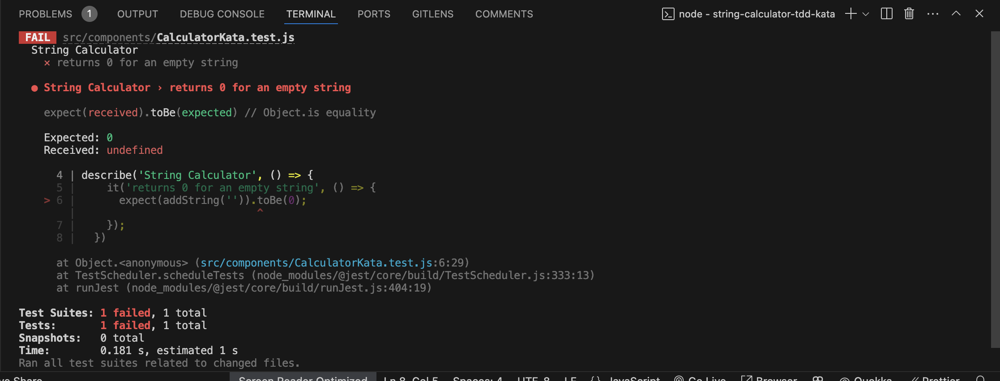
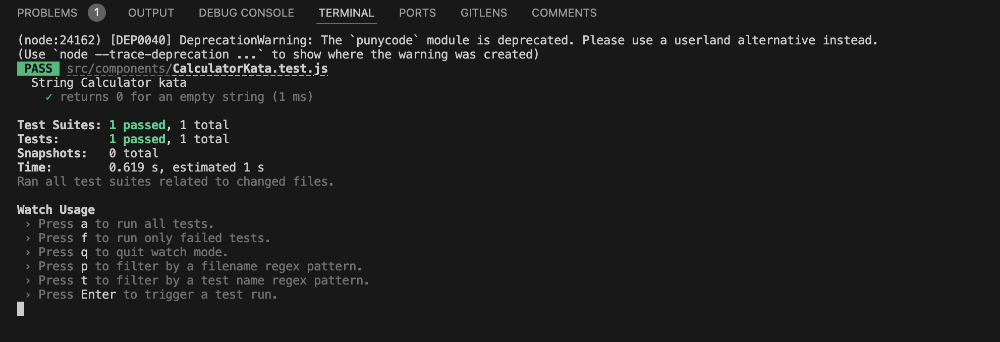
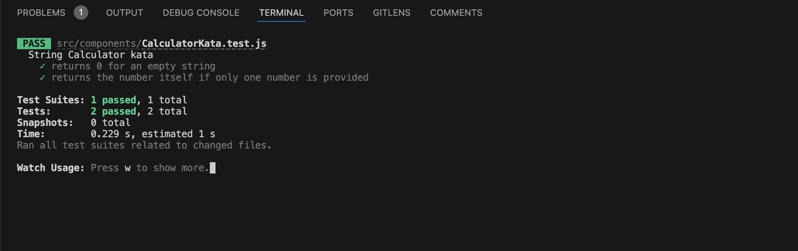

# String Calculator TDD Kata — Incubyte Assessment

This repository contains my solution to the **String Calculator TDD Kata** as part of the **Incubyte Software Craftsperson hiring process for React developer role**.

The solution is built in **React** using the **Jest** testing framework and follows the **Test-Driven Development (TDD)** cycle strictly:

 🔴 Write a failing test → 🟢 Make it pass → ♻️ Refactor if required

**Scroll to bottom of the page for step by step screenshot table**
---

# Getting Started with Create React App

This project was bootstrapped with [Create React App](https://github.com/facebook/create-react-app).

## Available Scripts

In the project directory, you can run:

### `npm start`

Runs the app in the development mode.\
Open [http://localhost:3000](http://localhost:3000) to view it in your browser.

The page will reload when you make changes.\
You may also see any lint errors in the console.

### `npm test`

Launches the test runner in the interactive watch mode.\
See the section about [running tests](https://facebook.github.io/create-react-app/docs/running-tests) for more information.

### `npm run build`

Builds the app for production to the `build` folder.\
It correctly bundles React in production mode and optimizes the build for the best performance.

The build is minified and the filenames include the hashes.\
Your app is ready to be deployed!

See the section about [deployment](https://facebook.github.io/create-react-app/docs/deployment) for more information.

## 📋 Features and TDD Test Cases

| #   | Requirement                                                   | Input                                          | Output       | 🔴 Failing Test Screenshot               | 🟢 Passing Test Screenshot               |
| --- | ------------------------------------------------------------- | ---------------------------------------------- | ------------ | ---------------------------------------- | ---------------------------------------- |
| 1   | Empty string returns 0                                        | `""`                                           | `0`          |   |   |
| 2   | Single number returns the number                              | `"1"`                                          | `1`          |   |   |
| 3   | Multiple comma-separated numbers                                  | `"1,2,3"`                                        | `3`          |   |   |
| 4   | Support newline `\n` as delimiter                             | `"1,2,3\n5,4"`                                     | `15`          |   |   |
| 5   | Custom single-character delimiter                             | `"//;\n1;2"`                                   | `3`          |   |   |
| 6   | Exception on one or more negative number                              | `"1,-2"`                                       | Error        |   |   |
| 7   | Ignore numbers >1000 but include 1000                         | `"2,1001"` / `"2,1000"`                        | `2` / `1002` |   |   |
| 8  | Support multi-character custom delimiter (e.g. `[***]`)       | `"//[***]\n1***2***3"`                         | `6`          | Already supports multi-character so did not fail             |  |
